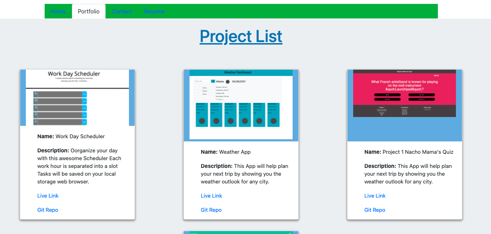

#Project ReadMe 

Using React Library I developed mobile responsive portofolio. 

* Using React Bootstrap component it has this features. 

   * A navbar

   * A responsive layout

   * Responsive images

   * It also uses Bootstrap's grid system.

  [Deployed Application]()

